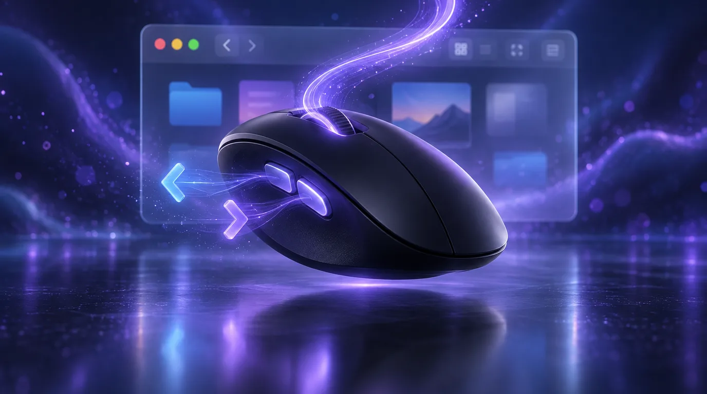

# Mikey Mouse



A small macOS menu-bar tool that makes a normal mouse behave like it belongs
on a Mac. It replaces the two Mac Mouse Fix features I actually used.

- **Back and forward buttons.** The side buttons go back and forward in Finder,
  Safari, and other Apple apps, which ignore mouse buttons 4 and 5.
- **Smooth scrolling.** Each notch of the scroll wheel glides instead of
  jumping a few lines at a time.

## Setup

```bash
bash tools/mikey-mouse/setup_mac.sh
```

The setup runs the tests, builds and signs `~/Applications/Mikey Mouse.app`,
starts it, and installs it as a login service.

Grant **Mikey Mouse** access in:

`System Settings > Privacy & Security > Accessibility`

A mouse icon appears in the menu bar. It shows `!` until the permission is
granted. The menu toggles each feature, picks the scroll speed and smoothness,
and turns start-at-login on or off.

Quit Mac Mouse Fix, SensibleSideButtons, or LinearMouse before using it.
Two tools handling the same buttons will fight.

## How it works

The app installs a CoreGraphics event tap on its own thread.

### Side buttons

Finder and Safari have no idea what mouse buttons 4 and 5 are, but they do
understand the trackpad "swipe between pages" gesture. When a side button is
pressed over one of those apps, Mikey Mouse swallows the click and posts a
navigation swipe instead. The gesture uses private CoreGraphics event fields
that WebKit documents in `CoreGraphicsTestSPI.h`.

Apps that already handle the side buttons, such as Chrome and VS Code, get the
original click untouched. The list of apps that get swipes comes from
LinearMouse (MIT): every `com.apple.*` app, ForkLift, Firefox, and Opera.

### Smooth scrolling

A notched wheel sends one line-based event per notch. Mikey Mouse swallows it
and adds a fixed distance to travel. A 120 Hz timer then posts continuous pixel
scroll events, each moving a fixed share of the distance that is left, so the
motion starts fast and eases out. Notches that arrive quickly travel further,
up to 5x, which is how a fast flick covers a page.

Trackpads, the Magic Mouse, and any scroll with Shift, Control, Option, or
Command held pass through unchanged, so zoom and sideways scrolling keep their
normal behaviour.

| Setting | Slow | Medium | Fast |
|---|---|---|---|
| Scroll speed (pixels per notch) | 40 | 64 | 96 |

| Setting | Low | Medium | High |
|---|---|---|---|
| Smoothness (time constant) | 45 ms | 70 ms | 100 ms |

## Development

```bash
swift test --package-path tools/mikey-mouse
bash tools/mikey-mouse/restart.sh
tail -f ~/Library/Logs/mikey-mouse.log
```

Always use `restart.sh` after a Swift change so the staged, consistently signed
app is tested. Running the raw SwiftPM executable gives macOS a different
Accessibility identity.

Every side-button press is logged with the app under the pointer. To also log
one line per scroll glide:

```bash
defaults write com.mikerosoft.mikey-mouse debugLogging -bool true
bash tools/mikey-mouse/restart.sh
```

To stop it and remove it from login:

```bash
bash tools/mikey-mouse/uninstall.sh
```

The app icon is `mouse.png` from Mark James's famfamfam Silk icon set,
licensed under CC BY 2.5.
