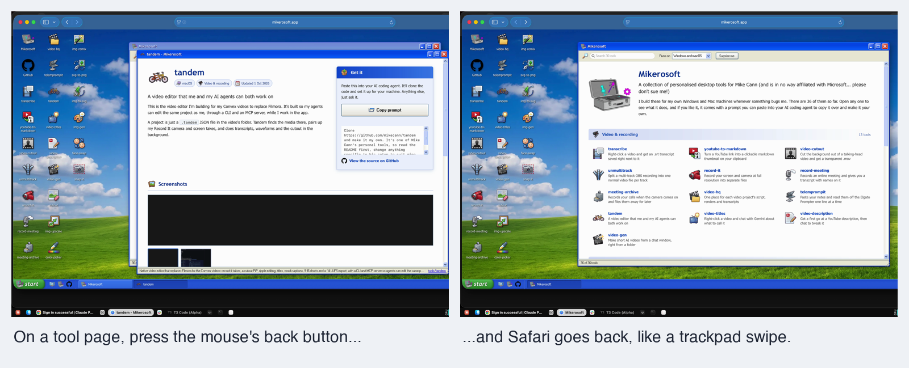

#  mikey-mouse

Makes a normal mouse feel at home on a Mac

macOS

<!-- media: hero -->


[Watch it run (5 seconds)](docs/demo.mp4)
<!-- /media: hero -->

## What it is

This replaces the two Mac Mouse Fix features I actually used. The side buttons
on my mouse go back and forward in Finder, Safari and other Apple apps, which
normally just ignore them.

It also makes a notched scroll wheel glide instead of jumping a few lines at a
time. It all lives in a little menu-bar icon.

## Get it

Paste this into your AI coding agent (Claude Code, Codex, Cursor...):

> Clone https://github.com/mikecann/mikey-mouse and make it my own. It's one of Mike
> Cann's personal tools, so read the README first, change anything specific to his
> setup to suit mine, then help me get it running.

### Or set it up by hand

You'll need macOS 13 or newer, Git, and Swift 5.10 or newer from Xcode or the
Command Line Tools. If you haven't installed Apple's developer tools yet, run
`xcode-select --install` first. No API keys or `.env` file are needed.

```bash
git clone https://github.com/mikecann/mikey-mouse.git
cd mikey-mouse
bash install.sh
bash setup_mac.sh
```

`install.sh` links the `mikey-mouse` launcher into `~/.local/bin`. Add that
directory to your shell's PATH if needed. You can choose another directory with
`bash install.sh /path/to/bin`; re-run it if you move the clone.

The setup runs the tests, builds and signs `~/Applications/Mikey Mouse.app`,
starts it, and installs it as a login service. Signing uses a local Apple
Development identity if available, otherwise an ad-hoc signature.

Grant **Mikey Mouse** access in:

`System Settings > Privacy & Security > Accessibility`

Quit Mac Mouse Fix, SensibleSideButtons, or LinearMouse before using it.
Two tools handling the same buttons will fight.

## Using it

A mouse icon appears in the menu bar. It shows `!` until Accessibility
permission is granted. Click it to toggle back/forward buttons or smooth
scrolling, pick scroll speed and smoothness, or turn start-at-login on or off.

Press your mouse's side buttons over Finder or Safari to go back and forward.
Turn the wheel to scroll smoothly. Apps such as Chrome and VS Code keep their
normal side-button handling.

```bash
mikey-mouse restart
mikey-mouse stop
```

The launcher defaults to `restart`, which rebuilds and starts the staged app.
You can also run the scripts directly from the clone.

## How it works

The app installs a CoreGraphics event tap on its own thread.

### Side buttons

Finder and Safari have no idea what mouse buttons 4 and 5 are, but they do
understand the trackpad "swipe between pages" gesture. When a side button is
pressed over one of those apps, Mikey Mouse swallows the click and posts a
navigation swipe instead. The gesture uses private CoreGraphics event fields
that WebKit documents in `CoreGraphicsTestSPI.h`.

Apps that already handle the side buttons, such as Chrome and VS Code, get the
original click untouched. The list of apps that get swipes comes from
LinearMouse (MIT): every `com.apple.*` app, ForkLift, Firefox, and Opera.

### Smooth scrolling

A notched wheel sends one line-based event per notch. Mikey Mouse swallows it
and adds a fixed distance to travel. A 120 Hz timer then posts continuous pixel
scroll events, each moving a fixed share of the distance that is left, so the
motion starts fast and eases out. Notches that arrive quickly travel further,
up to 5x, which is how a fast flick covers a page.

Trackpads, the Magic Mouse, and any scroll with Shift, Control, Option, or
Command held pass through unchanged, so zoom and sideways scrolling keep their
normal behaviour.

| Setting | Slow | Medium | Fast |
|---|---|---|---|
| Scroll speed (pixels per notch) | 40 | 64 | 96 |

| Setting | Low | Medium | High |
|---|---|---|---|
| Smoothness (time constant) | 45 ms | 70 ms | 100 ms |

## Development

```bash
swift test
bash Tests/install-tests.sh
bash restart.sh
tail -f ~/Library/Logs/mikey-mouse.log
```

Always use `restart.sh` after a Swift change so the staged, consistently signed
app is tested. Running the raw SwiftPM executable gives macOS a different
Accessibility identity.

Every side-button press is logged with the app under the pointer. To also log
one line per scroll glide:

```bash
defaults write com.mikerosoft.mikey-mouse debugLogging -bool true
bash restart.sh
```

To stop it and remove it from login:

```bash
bash uninstall.sh
```

If you installed the launcher into a custom directory, pass that same directory
to `uninstall.sh`. It removes this clone's launcher and the Mikey Mouse login
service. The app, settings and logs remain; delete `~/Applications/Mikey Mouse.app`
manually if you also want to remove the app.

### Build settings

`build-app.sh` accepts these optional environment variables:

| Variable | Default | Purpose |
|---|---|---|
| `MIKEY_MOUSE_BUILD_CONFIGURATION` | `release` | Swift build configuration |
| `MIKEY_MOUSE_CODESIGN_IDENTITY` | Auto-detected, or `-` | Signing identity; `-` forces ad-hoc signing |
| `MIKEY_MOUSE_APP_DIR` | `~/Applications/Mikey Mouse.app` | App staging location |

Use the default app location for normal installs. The menu's start-at-login
setting writes that default location, even if a script used a custom app path.
The bundle identifier stays `com.mikerosoft.mikey-mouse` so existing preferences
and Accessibility grants keep the same identity.

### Troubleshooting

If the menu shows `!`, enable the staged app in Accessibility settings. Use
`bash restart.sh` after rebuilding, rather than running `.build` executables,
and check `~/Library/Logs/mikey-mouse.log` if the app does not stay running.

Automated tests check routing, scroll policy, animation and settings without
installing an event tap. Real button presses and scroll feel still need a mouse
and the signed app with Accessibility permission.

## Credits

The app icon is `mouse.png` from Mark James's famfamfam Silk icon set,
licensed under [CC BY 2.5](https://creativecommons.org/licenses/by/2.5/).
The icon's licence applies separately from the code's MIT licence.

## More tools

My other tools are at [mikerosoft.app](https://mikerosoft.app).

MIT licensed.
